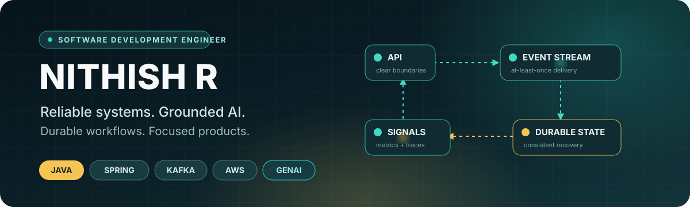
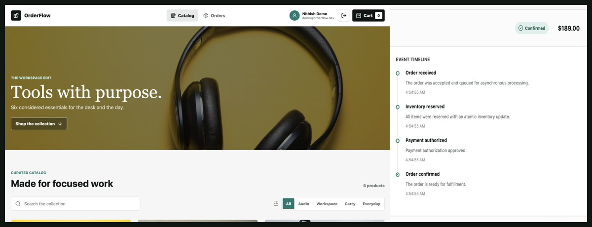

  

  
  
  

I build **failure-aware backend systems** and connect them to focused product
experiences. My work emphasizes durable workflows, clear service boundaries,
and observable operations.

## Generative AI systems

I design AI workflows that are grounded, evaluated, and deployable.

- **Grounded retrieval:** conversation-aware PDF question answering with hybrid
  FAISS + BM25 retrieval, rank fusion, citation validation, and evidence
  sufficiency checks
- **Structured generation:** Wikipedia-grounded quiz generation with
  schema-constrained outputs, source validation, duplicate rejection, and
  explainable ranking
- **Multimodal ML delivery:** infrared and visible-light image fusion behind
  FastAPI, with durable S3/SQS/DynamoDB jobs and autoscaling EKS deployment

**Current direction:** safe agentic commerce for product discovery and order
operations, using scoped tools, approval gates, audit logs, and regression evals.

## Featured system

### [OrderFlow — event-driven commerce platform](https://github.com/NithishKumar04/orderflow-platform)

A full-stack checkout workflow designed for duplicate delivery, concurrency,
and partial failure—not just the happy path.

| Durable messaging | Consistent state | Production feedback |
| --- | --- | --- |
| Transactional outbox, bounded retries, dead-letter handling, idempotent consumers | Atomic inventory reservation, optimistic locking, compensation | Health probes, Prometheus metrics, correlation IDs, integration tests, full-topology CI |

[Repository](https://github.com/NithishKumar04/orderflow-platform) ·
[Architecture](https://github.com/NithishKumar04/orderflow-platform/blob/main/docs/architecture.md) ·
[ADRs](https://github.com/NithishKumar04/orderflow-platform/tree/main/docs/adr) ·
[Testing](https://github.com/NithishKumar04/orderflow-platform/blob/main/docs/testing.md)

## How I engineer

<table>
  <tr>
    <td width="50%" valign="top">
      <h3>⚙️ Backend systems</h3>
      
APIs, concurrency, durable state, validation, security, and explicit failure recovery.

    </td>
    <td width="50%" valign="top">
      <h3>↝ Event-driven workflows</h3>
      
Transactional publication, idempotent delivery, bounded retries, compensation, and observable state transitions.

    </td>
  </tr>
  <tr>
    <td width="50%" valign="top">
      <h3>☁️ Cloud and operations</h3>
      
Containerized delivery, CI/CD, health signals, metrics, and infrastructure designed around operational feedback.

    </td>
    <td width="50%" valign="top">
      <h3>◫ Product delivery</h3>
      
Focused interfaces built around clear service boundaries, useful workflows, and well-designed data models.

    </td>
  </tr>
</table>

## Open source

**[detekt/detekt](https://github.com/detekt/detekt)** ·
[Merged contribution](https://github.com/detekt/detekt/pull/9599) clarifying
multi-preview annotation suppression in the Kotlin static-analysis documentation.

## Toolbox

  
  
  
  
  
  
  
  
  

## Connect

[LinkedIn](https://www.linkedin.com/in/nithish-r-47ab42205/) is the best place
to reach me.
